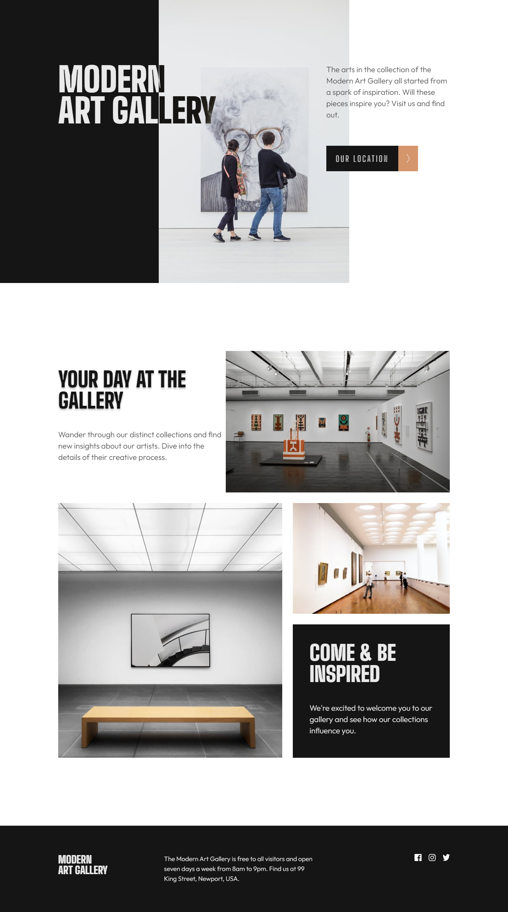

# Frontend Mentor - Art gallery website solution

This is a solution to the [Art gallery website challenge on Frontend Mentor](https://www.frontendmentor.io/challenges/art-gallery-website-yVdrZlxyA). Frontend Mentor challenges help you improve your coding skills by building realistic projects. 

## Table of contents

- [Overview](#overview)
  - [The challenge](#the-challenge)
  - [Screenshot](#screenshot)
  - [Links](#links)
- [My process](#my-process)
  - [Built with](#built-with)
  - [What I learned](#what-i-learned)
  - [Continued development](#continued-development)
  - [Useful resources](#useful-resources)
- [Author](#author)


## Overview

### The challenge

Users should be able to:

- View the optimal layout for each page depending on their device's screen size
  - Specified viewspoints for the challenge are 375px and 1440px.
  - Not for the challenge: adjusted CSS for viewpoints beyond 1440px. Done to be less visually jarring, especially on widescreen monitors.
- See hover states for all interactive elements throughout the site.

### Screenshot

#### Desktop View - 1440px viewpoint



#### Mobile View - 375px viewpoint


### Links

- Solution URL: [https://github.com/VirtualVasquez/art-gallery-website-challenge](https://github.com/VirtualVasquez/art-gallery-website-challenge)
- Live Site URL: [https://virtualvasquez.github.io/art-gallery-website-challenge/](https://virtualvasquez.github.io/art-gallery-website-challenge/)

## My process

### Built with

- Semantic HTML5 markup
- CSS custom properties
- SASS
- Mobile-first workflow
- Google Fonts - specifically, "Big Shoulders Display" and "Outfit"

### What I learned

In my haste to want to complete the challenge as quickly as possible, I did end up needing to redo parts of the page again. Not necessarily due to previous implementations being bad or non-functional, but rather there were better, more organized ways to implement needed features, like controlling the resizing of text, and changing orienation of elements when on mobile versus on desktop. Next time, I'll try to wireframe both the HTML and CSS needed first, and make a more clearly laid out plan before beginning development.


From a technical standpoint, there were a few things I learned that was happy to get more familiar with in CSS and SASS

```css
.learned-this-css {
   /* this is what makes the color of the font change exclusively */
   /* on the parts where it overlaps another element, like a black div */
   mix-blend-mode: difference;
   color: white;
}
```
```scss
//maps in SASS makes using repeatedly used properties much less tedious
//abbrievated map to just one line
$header-font-sizes: (
  xl:(font-size: 96px, line-height:88px)
);
//mixins are what enable the retrieval of the properties defined in the map
@mixin header-size-properties($size){
    $properties: map-get($header-font-sizes, $size);
    font-size: map-get($properties, font-size);
    line-height: map-get($properties, line-height);
}
//use with @include in the appropriate selector
.element{
  @include header-size-properties($size);
}

```

### Continued development

Given more time and forethought, I would have liked to have separted the SASS files into different focuses, in order to make it easier to find and edit style properties being applied. While I believe I was successful in recreating the site from the figma design I was provided (not included in this repo), I would have also liked to make the styling rules more easily reused. 

For instance, some media queries are defined first, and then specify what elements are being manipulated. Other times, it's the element selector defined first, and then altered at specified media queries. Neither approach is wrong, but being more consistent in using either of the two would help in terms of readability and maintability.

### Useful resources

- [W3schools.com](https://www.w3schools.com/) - This was primarily useful for double-checking a few properties related to fonts, in particular the mix-blend-mode. 
- [sass-lang.com](https://sass-lang.com/documentation/at-rules/mixin/) - I have previous experience working with SASS, but was a little shaky in understanding maps and mixins.

## Author

- Melvin Vasquez 
  - [Portfolio Site](https://www.melvinvasquez.com)
  - [LinkedIn Profile](https://www.linkedin.com/in/melvin-vasquez)